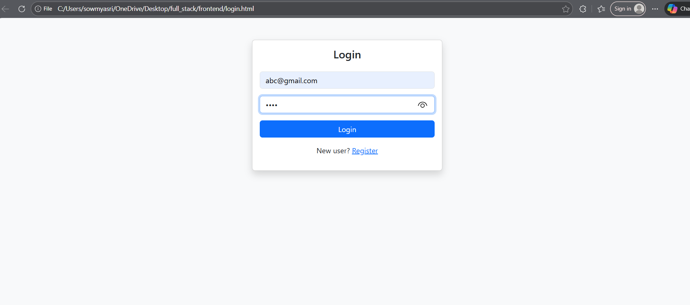
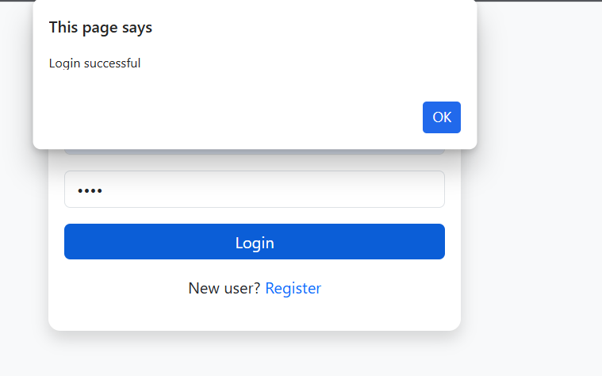
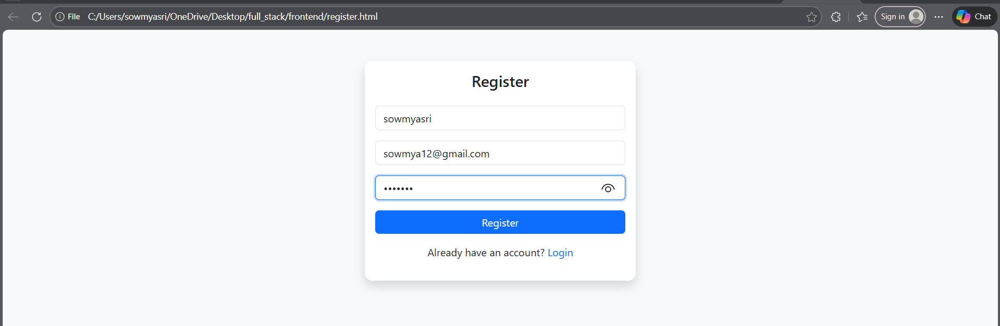
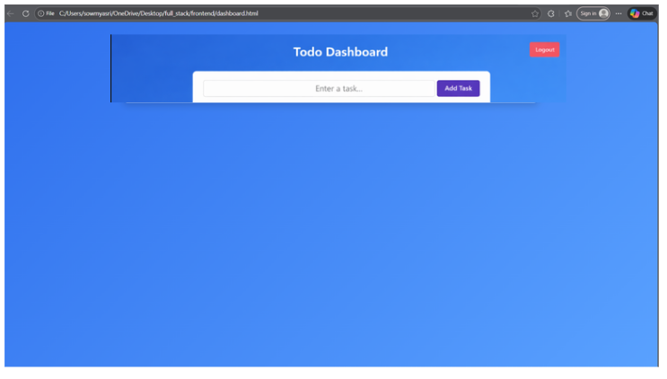

# 📝 Task Manager – Full Stack Web Application

## 📌 Problem Statement

**End-to-End Full Stack Web Application**

Build a basic full-stack web application with complete frontend and backend integration, including user authentication, data management, and API communication.

---

## 🎯 Project Overview

The **Task Manager** is a full-stack web application that allows users to:

- 🔐 Register and log in securely
- 📝 Create, view, and manage personal tasks
- 👤 Maintain user-specific data using sessions
- 🔗 Interact with a RESTful API-backed backend

This project demonstrates **system thinking, REST API design, and frontend–backend integration**.

---

## 🛠️ Tech Stack

### 🔹 Frontend

- HTML5
- CSS3
- Bootstrap 5
- JavaScript (Fetch API)

### 🔹 Backend

- Python
- Flask
- Flask-CORS

### 🔹 Database

- MySQL

---

## ✨ Features

### 🔐 Authentication

- User registration
- Secure login using hashed passwords
- Session-based authentication
- Logout functionality

### 📋 Task Management

- Add tasks
- View user-specific tasks
- Delete tasks
- Protected API routes

---

## 📂 Project Structure

```
Task-Manager/
│
├── frontend/
│   ├── index.html
│   ├── register.html
│   ├── dashboard.html
│   ├── css/
│   │   └── style.css
│   └── js/
│       └── auth.js
│
├── backend/
│   ├── app.py
│   ├── db.py
│   └── requirements.txt
│
├── screenshots/
│   ├── login.png
│   ├── register.png
│   └── dashboard.png
│
└── README.md
```

---

## 🔗 API Endpoints

### 🔐 Authentication APIs

| Method | Endpoint        | Description       |
| ------ | --------------- | ----------------- |
| POST   | `/api/register` | Register new user |
| POST   | `/api/login`    | User login        |
| POST   | `/api/logout`   | User logout       |

### 📋 Task APIs

| Method | Endpoint          | Description                |
| ------ | ----------------- | -------------------------- |
| GET    | `/api/tasks`      | Fetch logged-in user tasks |
| POST   | `/api/tasks`      | Add new task               |
| DELETE | `/api/tasks/<id>` | Delete task                |

---

## 🗄️ Database Schema

### 👤 Users Table

```sql
CREATE TABLE users (
    id INT AUTO_INCREMENT PRIMARY KEY,
    name VARCHAR(100),
    email VARCHAR(100) UNIQUE,
    password VARCHAR(255)
);
```

### 📝 Tasks Table

```sql
CREATE TABLE tasks (
    id INT AUTO_INCREMENT PRIMARY KEY,
    user_id INT,
    title VARCHAR(255),
    FOREIGN KEY (user_id) REFERENCES users(id)
);
```

---

## 🖼️ Screenshots

### 🔐 Login Page




### 📝 Register Page



### 📋 Dashboard




---

## ▶️ How to Run the Project

### Backend Setup

```bash
pip install -r requirements.txt
python app.py
```

Backend runs on:

```
http://localhost:5000
```

### Frontend

- Open `index.html` in browser
- Register → Login → Dashboard

---

## ✅ Evaluation Focus

| Criteria            | Implementation                                      |
| ------------------- | --------------------------------------------------- |
| System Thinking     | Clear separation of frontend, backend, and database |
| API Design          | RESTful APIs                                        |
| Integration Quality | Fetch API with session handling                     |

---

## 👩‍💻 Author

**Sowmya Sri**  
Full Stack Developer (Student)
